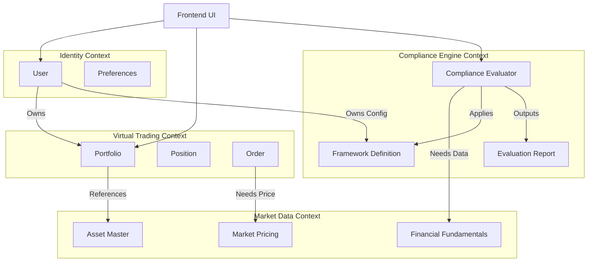

# 09 — Domain Models

> **Document Status:** Living Document · v1.0
> **Last Updated:** 2026-06-25
> **Owner:** Backend Engineering / Software Architecture
> **Audience:** Backend Engineers, Database Architects, Product Managers
> **Depends On:** `00-product-foundation.md`, `14-compliance-engine.md`, `15-paper-trading-engine.md`

---

## Table of Contents

1. [Purpose](#1-purpose)
2. [Goals](#2-goals)
3. [Scope](#3-scope)
4. [Executive Summary](#4-executive-summary)
5. [Bounded Contexts Overview](#5-bounded-contexts-overview)
6. [Context 1: User & Identity](#6-context-1-user--identity)
7. [Context 2: Virtual Trading & Portfolio](#7-context-2-virtual-trading--portfolio)
8. [Context 3: Compliance Framework Engine](#8-context-3-compliance-framework-engine)
9. [Context 4: Market & Financial Data](#9-context-4-market--financial-data)
10. [Cross-Context Interactions & Aggregates](#10-cross-context-interactions--aggregates)
11. [Tradeoffs](#11-tradeoffs)
12. [Risks](#12-risks)
13. [Future Expansion](#13-future-expansion)
14. [Dependencies](#14-dependencies)
15. [Engineering Notes](#15-engineering-notes)
16. [Recruiter Impact Notes](#17-recruiter-impact-notes)
17. [Business Impact Notes](#18-business-impact-notes)
18. [Document Cross-References](#19-document-cross-references)

---

## 1. Purpose

This document defines the core Domain-Driven Design (DDD) abstractions for HalalTrade (working name). Before defining a database schema (`10-database-design.md`) or REST API (`13-api-design.md`), we must establish the ubiquitous language used by both the business and engineering teams.

Defining explicit bounded contexts prevents the "Big Ball of Mud" architectural anti-pattern. Most importantly, this document establishes the strict separation between the logic that executes trades and the logic that evaluates compliance.

---

## 2. Goals

| # | Goal | Measure |
|---|---|---|
| DM-1 | Establish a Ubiquitous Language | Developers, PMs, and Designers use the exact same terms (e.g., `EvaluationReport`, not "Screening Result"). |
| DM-2 | Decouple Trading from Compliance | The `Order` entity must have zero knowledge of Islamic Jurisprudence or ESG logic. |
| DM-3 | Define Pluggable Interfaces | Standardize the input/output contracts for the Compliance Framework Engine. |
| DM-4 | Protect Data Integrity | Identify which entities are "Aggregates" that enforce strict transactional boundaries. |

---

## 3. Scope

### 3.1 In Scope
- Identification of the four primary Bounded Contexts.
- Definition of core Entities (objects with identity) vs. Value Objects (immutable data structures).
- Relationships and boundary definitions between domains.
- The standard JSON contract for compliance evaluations.

### 3.2 Out of Scope
- Specific Postgres table definitions or ORM code (Covered in `10-database-design.md`).
- Specific API route definitions (Covered in `13-api-design.md`).
- Infrastructure scaling details.

---

## 4. Executive Summary

The HalalTrade backend architecture is a modular monolith strictly divided into four **Bounded Contexts**:
1. **User Identity**
2. **Virtual Trading**
3. **Compliance Engine**
4. **Market Data**

The golden rule of this architecture is **Agnosticism**. A `Portfolio` does not know it is a "Halal Portfolio." It is merely a collection of `Positions` (AAPL, MSFT). The `Compliance Engine` independently takes those `Positions`, applies a `Framework`, and returns an `EvaluationReport`. 

By strictly enforcing this separation, the platform can infinitely scale to new compliance philosophies (ESG, Value Investing) without ever touching the core trading or portfolio ledgers.

---

## 5. Bounded Contexts Overview



---

## 6. Context 1: User & Identity

Responsible for authentication, authorization, and overarching user configurations.

| Entity / Object | Type | Description |
|---|---|---|
| `User` | Entity (Aggregate Root) | Represents the human. Identified by UUID. Holds OAuth IDs and basic profile data. |
| `UserPreferences` | Entity | 1:1 with User. Stores UI state (dark mode) and, critically, the ID of their currently active `Framework`. |
| `FrameworkOverride` | Entity | Stores a specific user's custom threshold tweaks for a specific framework (e.g., Fatima setting Debt-to-Equity to 30% instead of the default 33%). |

---

## 7. Context 2: Virtual Trading & Portfolio

Responsible for managing virtual capital, executing paper trades, and maintaining ledger accuracy. **This context has no compliance logic.**

| Entity / Object | Type | Description |
|---|---|---|
| `Portfolio` | Entity (Aggregate Root) | Owns the user's total balance. 1:1 with `User`. Enforces constraints (cannot buy if `available_cash` < order total). |
| `Position` | Entity | Represents an open holding. Child of `Portfolio`. (e.g., 100 shares of AAPL at $150 avg price). |
| `Order` | Entity | Immutable record of intent. States: `PENDING`, `EXECUTED`, `FAILED`, `CANCELLED`. |
| `Transaction` | Entity | The immutable ledger entry representing the actual movement of cash and shares when an `Order` executes. |
| `Money` | Value Object | Encapsulates amount and currency (e.g., `{ amount: 150000, currency: "USD" }`). Prevents floating-point math errors. |

**Key DDD Rule:** `Portfolio` is the Aggregate Root. You cannot modify a `Position` directly. You must submit an `Order` to the `Portfolio`, which validates it and generates a `Transaction` to update the `Position`.

---

## 8. Context 3: Compliance Framework Engine

The intellectual property of the platform. Evaluates assets against rule sets.

| Entity / Object | Type | Description |
|---|---|---|
| `Framework` | Entity | A logical grouping of compliance rules (e.g., "AAOIFI Halal Standard", "Strict ESG"). |
| `Rule` | Value Object | A specific calculation or filter (e.g., "Debt-to-Equity Ratio"). Defines the default `threshold` and the mathematical `operator` (<, >, ==). |
| `EvaluationReport` | Value Object | The standard, immutable output contract generated by the engine. Contains the overall verdict and rule-by-rule breakdowns. |
| `Explanation` | Value Object | The human-readable string generated by the engine detailing exactly *why* a rule passed or failed. |

### 8.1 The Standard Evaluation Contract (Output schema)
This is the most critical data structure in the app. The UI is hardcoded to expect exactly this shape, allowing the backend to swap frameworks without breaking the frontend.

```typescript
type EvaluationReport = {
  assetId: string;
  frameworkId: string;
  timestamp: string; // ISO 8601
  verdict: 'COMPLIANT' | 'NON_COMPLIANT' | 'WARNING' | 'INSUFFICIENT_DATA';
  rules: Array<{
    ruleId: string;
    name: string; // e.g., "Debt-to-Equity"
    passed: boolean;
    actualValue: string; // e.g., "31.5%"
    thresholdValue: string; // e.g., "< 33%"
    explanation: string; // "Total debt of $110B divided by total equity of $350B is 31.5%, which is below the maximum allowed threshold of 33%."
  }>;
}
```

---

## 9. Context 4: Market & Financial Data

The adapter layer for third-party financial data providers. It normalizes messy external data into our internal domain models.

| Entity / Object | Type | Description |
|---|---|---|
| `Asset` | Entity (Aggregate Root) | The master record for a stock/ETF (e.g., AAPL). Contains static metadata (Sector, Industry, CUSIP). |
| `FinancialFundamentals` | Value Object | Quarterly/Annual data required for compliance math (Total Assets, Total Debt, Interest Income). Overwritten/versioned upon new earnings releases. |
| `MarketQuote` | Value Object | The current price data (Price, Volume, Change). Highly volatile, heavily cached. |
| `SectorClassification` | Value Object | Standardized industry mapping (e.g., GICS codes) used heavily by filtering rules. |

---

## 10. Cross-Context Interactions & Aggregates

Because contexts are isolated, they communicate via domain services or defined APIs.

### 10.1 The "Portfolio Evaluation" Flow
When Fatima views her portfolio, the system must display the compliance status of her holdings.
1. The **Trading Context** loads the `Portfolio` and its `Positions` (e.g., AAPL, TSLA).
2. The UI queries the **User Context** for Fatima's active `FrameworkId` and `FrameworkOverrides`.
3. The UI (or an API Gateway) calls the **Compliance Context**: *"Evaluate [AAPL, TSLA] using Framework X with Overrides Y."*
4. The **Compliance Context** fetches required `FinancialFundamentals` from the **Market Data Context**.
5. The **Compliance Context** returns an array of `EvaluationReports`.
6. The UI merges the Trading data (Qty, PnL) with the Compliance data (Verdict) for display.

*Crucially: The Portfolio table in the database never stores the string "Halal". It is evaluated at runtime or cached dynamically.*

---

## 11. Tradeoffs

| Decision | Chosen Option | Alternative | Rationale |
|---|---|---|---|
| **Architecture** | Modular Monolith | Microservices | A team of 1-3 engineers cannot maintain the DevOps overhead of 4 separate microservices. A modular monolith enforces domain boundaries at the code/module level without the latency of network calls. |
| **Number Handling** | High-Precision Decimals | Float64 / Double | Financial applications must never use floating-point math (e.g., 0.1 + 0.2 = 0.30000000000000004). We mandate Decimal types or Integer storage (cents). |
| **Data Immutability** | Value Objects for Reports | Mutable Entities | Once an `EvaluationReport` is generated for a specific timestamp, it must never change. If a company's data changes, a *new* report is generated. This is essential for historical auditing. |

---

## 12. Risks

| Risk | Severity | Mitigation |
|---|---|---|
| **Leaky Abstractions** | High | A developer adds a `is_halal` boolean directly to the `Asset` table to save time, destroying the multi-framework architecture. **Mitigation:** Strict code review enforcing the rule that the Market Data context cannot depend on the Compliance context. |
| **Evaluation Performance** | Medium | Evaluating a 50-stock portfolio on the fly is slow. **Mitigation:** The `EvaluationReport` is highly cacheable. If the underlying `FinancialFundamentals` haven't changed since yesterday, we return the cached report. |

---

## 13. Future Expansion

| Feature | Domain Impact | Phase |
|---|---|---|
| **Purification Engine** | New Bounded Context. Requires reading from Trading (Dividend history) and Compliance (Impermissible income ratios) to generate `PurificationLedger` entries. | Phase 2 |
| **Real Brokerage Integration** | Trading Context is expanded. `Order` entity now has subclasses: `PaperOrder` and `LiveBrokerOrder`. | Phase 3 |

---

## 14. Dependencies

| Dependency | Type | Impact |
|---|---|---|
| **Third-Party Data API (e.g., FMP, Polygon)** | External | The `Market Data` context acts as an Anti-Corruption Layer (ACL). If the provider changes their JSON schema, only the Market Data adapter changes; the rest of the app is protected. |
| **Database Schema (`10`)** | Internal | The ERD will directly reflect the relationships established in this document. |

---

## 15. Engineering Notes

- **Anti-Corruption Layer (ACL):** When importing fundamental data from external APIs, it is notoriously messy. The Market Data context must sanitize this data (e.g., standardizing null values to 0 where appropriate, throwing errors for critical missing data) before passing it to the Compliance Engine.
- **Value Object Equality:** In the backend code (e.g., TypeScript or Go), `Value Objects` (like `Money`) should implement equality methods based on their properties, not memory references. `$100 USD` is always equal to `$100 USD`.

---

## 16. Recruiter Impact Notes

### 16.1 What This Document Demonstrates
- **Senior Software Architecture:** Demonstrates mastery of Domain-Driven Design (DDD). Defining Bounded Contexts proves the ability to design systems that won't turn into unmaintainable spaghetti code as the company scales.
- **Separation of Concerns:** Explicitly decoupling the Trading Engine from the Compliance Engine is the most critical architectural decision of the project. Highlighting this shows strategic technical thinking.
- **Contract-Driven Development:** Defining the `EvaluationReport` output schema establishes a clear contract, allowing Frontend and Backend teams to work in parallel without blocking each other.

---

## 17. Business Impact Notes

- **The Multi-Framework Moat:** Because the domain models are inherently framework-agnostic, the business is not locked into Islamic Finance. If the company decides to launch "ESGTrade" next year, the Trading, Identity, and Market Data contexts require zero code changes.
- **Auditability:** By treating `Orders` and `EvaluationReports` as immutable value objects, the platform can historically prove *why* an asset was marked compliant on a specific date, which is crucial for building trust with analytical users (Persona: Fatima).

---

## 18. Document Cross-References

| Document | Relationship |
|---|---|
| `10-database-design.md` | Translates these conceptual DDD entities into physical Postgres tables, primary keys, and foreign keys. |
| `14-compliance-engine.md` | Deep dives into the specific algorithms inside Context 3. |
| `15-paper-trading-engine.md` | Deep dives into the transaction and ledger logic inside Context 2. |
| `13-api-design.md` | Defines the REST/GraphQL endpoints that expose these aggregates to the frontend. |

---

> **End of Document**
>
> Any proposal to introduce a cross-context dependency (e.g., the User entity directly modifying an Asset entity) must be thoroughly vetted against DDD principles before implementation.
