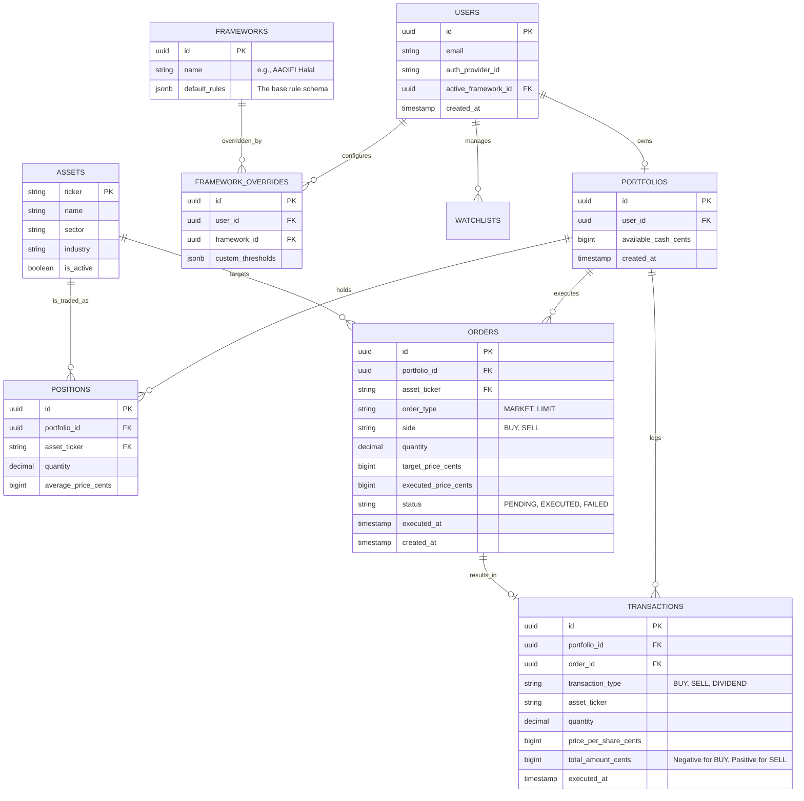

# 10 — Database Design

> **Document Status:** Living Document · v1.0
> **Last Updated:** 2026-06-25
> **Owner:** Backend Engineering / Database Administration
> **Audience:** Backend Engineers, Data Engineers
> **Depends On:** `09-domain-models.md`

---

## Table of Contents

1. [Purpose](#1-purpose)
2. [Goals](#2-goals)
3. [Scope](#3-scope)
4. [Executive Summary](#4-executive-summary)
5. [Technology Choices](#5-technology-choices)
6. [Entity Relationship Diagram (ERD)](#6-entity-relationship-diagram-erd)
7. [Schema Definitions (PostgreSQL)](#7-schema-definitions-postgresql)
8. [Handling Financial Data (Precision & Rounding)](#8-handling-financial-data-precision--rounding)
9. [JSONB Usage Strategy](#9-jsonb-usage-strategy)
10. [Indexing Strategy](#10-indexing-strategy)
11. [Tradeoffs](#11-tradeoffs)
12. [Risks](#12-risks)
13. [Future Expansion](#13-future-expansion)
14. [Dependencies](#14-dependencies)
15. [Engineering Notes](#15-engineering-notes)
16. [Recruiter Impact Notes](#16-recruiter-impact-notes)
17. [Business Impact Notes](#17-business-impact-notes)
18. [Document Cross-References](#18-document-cross-references)

---

## 1. Purpose

This document translates the conceptual abstractions from the Domain Models (`09-domain-models.md`) into a concrete, physical database schema. It establishes the rules for data integrity, precision handling for financial values, and the strategies for storing highly dynamic configurations (like user-defined compliance thresholds).

A robust database design is the bedrock of a financial application. A single rounding error or a missing foreign key constraint can destroy user trust instantly.

---

## 2. Goals

| # | Goal | Measure |
|---|---|---|
| DD-1 | Guarantee Financial Precision | 0% usage of `FLOAT` or `REAL` data types for financial values. All currency must use exact precision storage. |
| DD-2 | Enforce Domain Boundaries | Use explicit foreign keys to map relationships, but prevent the Trading tables from storing Compliance logic. |
| DD-3 | Enable Extensibility | Utilize Postgres `JSONB` for storing flexible framework rule thresholds without requiring schema migrations per new rule. |
| DD-4 | Optimize Read Paths | Ensure indexes support the heavy read-paths required for portfolio compliance evaluation. |

---

## 3. Scope

### 3.1 In Scope
- Core RDBMS schema (Tables, Columns, Relationships).
- Data type selection rules (specifically for money and percentages).
- Caching strategy (Redis).
- Usage guidelines for JSONB columns.

### 3.2 Out of Scope
- Specific ORM implementation code (e.g., Prisma schema or TypeORM entities).
- Infrastructure provisioning (Terraform, RDS instance sizing).
- Specific data ingestion pipelines for market data.

---

## 4. Executive Summary

HalalTrade utilizes **PostgreSQL** as the primary relational database and **Redis** for ephemeral caching (market quotes, evaluation reports). 

The schema strictly maps to the four Bounded Contexts. The core complexity lies in balancing strict relational integrity (for trades and portfolios) with flexible, document-style storage (using `JSONB` for compliance rule configurations). 

**Critical Rule:** Financial values (prices, cash balances) are stored as integers representing cents (e.g., $100.50 is stored as `10050`) to absolutely guarantee precision and avoid floating-point errors.

---

## 5. Technology Choices

| Technology | Purpose | Justification |
|---|---|---|
| **PostgreSQL (v15+)** | Primary Relational Store | ACID compliance is mandatory for virtual trading ledgers. Native `JSONB` support is essential for the Compliance Framework Engine's flexible schemas. |
| **Redis** | Caching & Rate Limiting | Market pricing updates every minute. Re-evaluating compliance on every request is too slow. Redis caches `EvaluationReports` and external API payloads. |

---

## 6. Entity Relationship Diagram (ERD)



---

## 7. Schema Definitions (PostgreSQL)

*(Note: Standard fields like `created_at` and `updated_at` are omitted below for brevity but are required on all tables).*

### 7.1 Identity Context
**Table: `users`**
- `id` (UUID, PK)
- `email` (VARCHAR(255), UNIQUE, INDEX)
- `active_framework_id` (UUID, FK -> `frameworks.id`) — *Defaults to the system's Halal framework.*

### 7.2 Trading Context
**Table: `portfolios`**
- `id` (UUID, PK)
- `user_id` (UUID, FK, UNIQUE, INDEX)
- `available_cash_cents` (BIGINT) — *Stores $100,000.00 as 10000000.*

**Table: `positions`**
- `id` (UUID, PK)
- `portfolio_id` (UUID, FK, INDEX)
- `asset_ticker` (VARCHAR(10), FK -> `assets.ticker`)
- `quantity` (DECIMAL(15, 6)) — *Must support fractional shares (e.g., 1.5432).*
- `average_price_cents` (BIGINT)

**Table: `orders`**
- `id` (UUID, PK)
- `portfolio_id` (UUID, FK, INDEX)
- `asset_ticker` (VARCHAR(10), FK)
- `side` (ENUM: 'BUY', 'SELL')
- `quantity` (DECIMAL(15, 6))
- `target_price_cents` (BIGINT, Nullable)
- `executed_price_cents` (BIGINT, Nullable)
- `status` (ENUM: 'PENDING', 'EXECUTED', 'FAILED')
- `executed_at` (TIMESTAMP, Nullable)

**Table: `transactions`** *(The Immutable Ledger)*
- `id` (UUID, PK)
- `portfolio_id` (UUID, FK, INDEX)
- `order_id` (UUID, FK, UNIQUE)
- `transaction_type` (ENUM: 'BUY', 'SELL', 'DIVIDEND')
- `asset_ticker` (VARCHAR(10))
- `quantity` (DECIMAL(15, 6))
- `price_per_share_cents` (BIGINT)
- `total_amount_cents` (BIGINT) — *Negative for purchases, positive for sales.*
- `executed_at` (TIMESTAMP, INDEX)

### 7.3 Compliance Context
**Table: `frameworks`**
- `id` (UUID, PK)
- `slug` (VARCHAR(50), UNIQUE) — e.g., `halal-aaoifi`
- `name` (VARCHAR(100))
- `default_rules` (JSONB) — *Defines the shape of rules and default limits.*

**Table: `framework_overrides`**
- `id` (UUID, PK)
- `user_id` (UUID, FK)
- `framework_id` (UUID, FK)
- `custom_thresholds` (JSONB) — *Stores only the user's diffs/overrides against the defaults.*

### 7.4 Market Data Context
**Table: `assets`**
- `ticker` (VARCHAR(10), PK)
- `name` (VARCHAR(255))
- `sector` (VARCHAR(100), INDEX)

---

## 8. Handling Financial Data (Precision & Rounding)

Financial applications must strictly govern number storage. A `FLOAT` type approximates decimals (e.g., 0.1 + 0.2 = 0.300000004), which causes cumulative ledger errors.

### 8.1 Currency (Prices & Cash)
- **Database Type:** `BIGINT`
- **Pattern:** Store the lowest possible denomination (cents).
- **Example:** To represent `$154.23`, store `15423`. To represent a $100k starting balance, store `10000000`.
- **Why:** Integer math is universally exact and faster than decimal math. The frontend or API layer is responsible for dividing by 100 before display.

### 8.2 Fractional Shares (Quantities)
- **Database Type:** `DECIMAL(15, 6)` or `NUMERIC(15, 6)`
- **Pattern:** Store up to 6 decimal places of precision.
- **Example:** User buys `1.503412` shares of TSLA.
- **Why:** You cannot store shares in "cents". `NUMERIC` in Postgres guarantees exact mathematical precision at the cost of slight performance overhead, which is acceptable for quantities.

---

## 9. JSONB Usage Strategy

The Compliance Engine requires immense flexibility. A framework might have 3 rules (e.g., Debt, Interest, Sector), while an ESG framework might have 15 completely different rules. Creating a Postgres column for `debt_to_equity_limit` ruins the multi-framework architecture.

### 9.1 The `frameworks.default_rules` Schema
```json
{
  "rules": {
    "debt_to_equity": {
      "type": "percentage",
      "operator": "less_than",
      "threshold": 33.33,
      "description": "Total Debt cannot exceed 33.33% of Trailing 12-Month Average Market Cap."
    },
    "impermissible_income": {
      "type": "percentage",
      "operator": "less_than",
      "threshold": 5.00
    }
  }
}
```

### 9.2 The `framework_overrides.custom_thresholds` Schema
When Fatima changes her debt rule to 30%, we do not copy the whole schema. We only store the override:
```json
{
  "debt_to_equity": {
    "threshold": 30.00
  }
}
```
**Runtime Merging:** The backend API merges the override on top of the default schema before passing it to the evaluation engine.

---

## 10. Indexing Strategy

| Table | Index Target | Rationale |
|---|---|---|
| `positions` | `(portfolio_id, asset_ticker)` | Finding all holdings for a user's dashboard is the most frequent query. This composite index makes it instant. |
| `orders` | `(portfolio_id, status)` | Fast lookups for displaying a user's "Pending" vs "Executed" history. |
| `transactions` | `(portfolio_id, executed_at)` | Essential for generating chronological account statements, trade history, and tax reports without table scans. |
| `assets` | `(sector)` | Allows fast screening (e.g., "Find all Tech stocks that pass the Halal framework"). |

---

## 11. Tradeoffs

| Decision | Chosen Option | Alternative | Rationale |
|---|---|---|---|
| **Currency Storage** | `BIGINT` (Cents) | `DECIMAL(15,2)` | While `DECIMAL` is exact, `BIGINT` integer math is computationally cheaper and eliminates the risk of ORMs accidentally mapping the database `DECIMAL` to a Javascript `number` (which is a float). Javascript `BigInt` securely maps to Postgres `BIGINT`. |
| **Compliance Storage** | Not stored (Computed) | Storing `is_halal` on `assets` | Evaluating compliance at runtime (or via Redis cache) instead of storing it in Postgres allows infinite user-level configurability (custom thresholds). |
| **Framework Logic** | `JSONB` configurations | Hardcoded Backend Logic | Storing rule configurations in the DB allows Product Managers to update thresholds without requiring a backend code deployment. |

---

## 12. Risks

| Risk | Severity | Mitigation |
|---|---|---|
| **JSONB Query Performance** | Medium | If we ever need to query across users (e.g., "Find all users whose custom debt threshold is < 30%"), JSONB queries are slow. **Mitigation:** Use Postgres `GIN` indexes on the JSONB column if cross-querying becomes necessary. |
| **Market Data Bloat** | High | Storing daily historical fundamentals for 10,000 assets will bloat the database massively. **Mitigation:** Rely on third-party APIs for historical data. Postgres only caches the *current* quarter's fundamentals needed for today's compliance engine run. |

---

## 13. Future Expansion

| Feature | Schema Impact | Phase |
|---|---|---|
| **Purification Logs** | Add `purification_ledger` table linked to `portfolios`. Tracks dividend events, the impermissible percentage applied, and the "purified" amount owed to charity. | Phase 2 |
| **Community Frameworks** | Add `is_public` flag and `author_id` to the `frameworks` table. Allows users to publish their JSONB configurations to the marketplace. | Phase 5 |

---

## 14. Dependencies

| Dependency | Type | Impact |
|---|---|---|
| **Prisma ORM** | Technical | The chosen ORM dictates how this physical schema is defined in code. Prisma handles `JSONB` and Postgres `ENUMs` exceptionally well. |
| **Redis** | Infrastructure | Acts as the buffer for this database. Without Redis caching the `EvaluationReports`, the Postgres DB would be overwhelmed by repetitive calculations. |

---

## 15. Engineering Notes

- **Optimistic Locking for Orders:** When an `Order` executes, it must deduct cash from the `Portfolio`. This must happen inside a Postgres `TRANSACTION`. Use `SELECT ... FOR UPDATE` (or Prisma's equivalent optimistic concurrency control) on the `Portfolio` row to prevent double-spend race conditions if two orders execute simultaneously.
- **Soft Deletes:** Do not use soft deletes (`deleted_at`) for `Orders` or `Transactions`. These are immutable financial ledgers. If an order fails, it is marked `FAILED`, never deleted.

---

## 16. Recruiter Impact Notes

### 16.1 What This Document Demonstrates
- **Fintech Best Practices:** The explicit ban on `FLOAT` data types for currency and the implementation of integer-based cents storage proves senior-level knowledge of financial software engineering.
- **Pragmatic NoSQL/SQL Blending:** Using Postgres `JSONB` for the Frameworks shows an understanding of how to blend the strict relational integrity needed for ledgers with the document-store flexibility needed for complex, evolving rule engines.
- **Performance Awareness:** Anticipating the read-heavy nature of the portfolio view and designing the Composite Indexes accordingly.

---

## 17. Business Impact Notes

- **Zero-Downtime Rule Updates:** Because compliance thresholds are stored as `JSONB` in the database rather than hardcoded in the backend codebase, a Product Manager or Shariah Scholar can tweak a threshold (e.g., shifting the default from 33.33% to 30.00%) via an internal admin panel without requiring an engineering deployment.
- **Scalable Intellectual Property:** The schema perfectly protects the platform's multi-framework moat. Launching a new ESG framework only requires inserting a new row into the `frameworks` table with a new `JSONB` schema, costing $0 in database redesign efforts.

---

## 18. Document Cross-References

| Document | Relationship |
|---|---|
| `09-domain-models.md` | The conceptual foundation for the tables defined here. |
| `14-compliance-engine.md` | Defines the specific math and logic that reads the `JSONB` configurations stored in this schema. |
| `15-paper-trading-engine.md` | Defines the transaction logic that relies on the exactness of the `BIGINT` and `DECIMAL` types specified here. |

---

> **End of Document**
>
> All schema migrations (e.g., adding a new column) must be reviewed against the "Agnosticism" rule. Does this new column tightly couple the Trading Context to a specific Compliance Framework? If yes, it must be redesigned.
