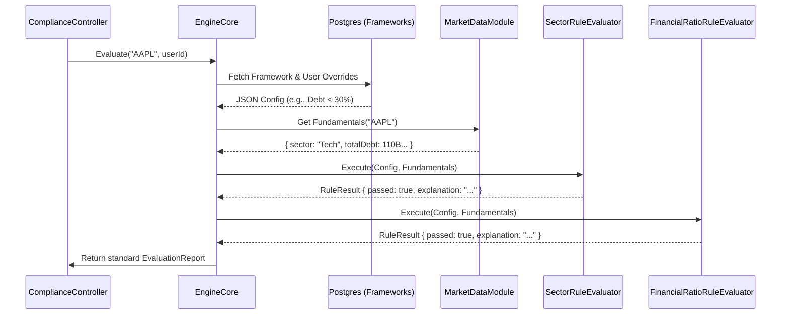

# 14 — Compliance Framework Engine

> **Document Status:** Living Document · v1.0
> **Last Updated:** 2026-06-25
> **Owner:** Principal Backend Architect / Domain Expert
> **Audience:** Backend Engineers, Product Managers, Compliance Officers
> **Depends On:** `00-product-foundation.md`, `09-domain-models.md`, `11-backend-architecture.md`

---

## Table of Contents

1. [Purpose](#1-purpose)
2. [Goals](#2-goals)
3. [Scope](#3-scope)
4. [Executive Summary](#4-executive-summary)
5. [Engine Architecture Overview](#5-engine-architecture-overview)
6. [Data Inputs & Dependencies](#6-data-inputs--dependencies)
7. [The Rule Evaluator Interface](#7-the-rule-evaluator-interface)
8. [The AAOIFI Halal Default Rules](#8-the-aaoifi-halal-default-rules)
9. [Dynamic Overrides (The Customization Flow)](#9-dynamic-overrides-the-customization-flow)
10. [The "Explainability" Layer](#10-the-explainability-layer)
11. [Handling "Insufficient Data"](#11-handling-insufficient-data)
12. [Tradeoffs](#12-tradeoffs)
13. [Risks](#13-risks)
14. [Future Expansion](#14-future-expansion)
15. [Dependencies](#15-dependencies)
16. [Engineering Notes](#16-engineering-notes)
17. [Recruiter Impact Notes](#17-recruiter-impact-notes)
18. [Business Impact Notes](#18-business-impact-notes)
19. [Document Cross-References](#19-document-cross-references)

---

## 1. Purpose

This document details the internal mechanics of the **Compliance Framework Engine**. The engine is the central nervous system and primary intellectual property (IP) of HalalTrade. 

Traditional trading platforms use simple boolean flags (e.g., `is_esg=true` from a data provider). HalalTrade rejects this. We ingest raw financial fundamentals, apply dynamically configurable rule sets, calculate the math at runtime, and generate human-readable explanations. This document explains how that complex pipeline operates.

---

## 2. Goals

| # | Goal | Measure |
|---|---|---|
| CE-1 | Total Explainability | The engine must never output a simple pass/fail. Every rule execution must produce a plain-English explanation of the underlying math. |
| CE-2 | Framework Agnosticism | The engine's core runner must not contain hardcoded logic for "Halal" or "ESG." It simply processes a generic array of `Rule` plugins. |
| CE-3 | Configuration over Code | Rule thresholds (e.g., 33.33% debt limit) must be defined in the database (JSONB), allowing non-engineers to adjust them instantly. |
| CE-4 | Predictable Degradation | When third-party APIs are missing a specific data point, the engine must safely fail to an "Insufficient Data" state, rather than guessing or crashing. |

---

## 3. Scope

### 3.1 In Scope
- The architectural pipeline (Inputs -> Evaluator -> Output).
- The exact algorithms and formulas for the default Islamic Finance (AAOIFI) standard.
- The interface design for `RuleEvaluator` classes.
- String template generation for the explainability layer.

### 3.2 Out of Scope
- Specific API route definitions to trigger the engine (`13-api-design.md`).
- Frontend rendering logic for the output (`08-component-library.md`).
- Definition of Phase 3 ESG Rules (Focus is on the Phase 1 Halal MVP).

---

## 4. Executive Summary

The Compliance Framework Engine operates like a compiler. 
1. It takes a **Target** (an Asset ticker like AAPL).
2. It fetches the required **Context** (raw financial fundamentals from our Market Data cache).
3. It loads the **Configuration** (the active Framework's JSONB threshold definitions).
4. It passes these into a pipeline of isolated **Rule Evaluators**.
5. It compiles the results into a standardized **Evaluation Report**.

The system is designed so that launching a new compliance framework (e.g., Shariah Standard B, or Green Energy ESG) requires *zero changes to the engine pipeline*. It only requires writing a new Rule class and adding a JSONB row to the database.

---

## 5. Engine Architecture Overview



---

## 6. Data Inputs & Dependencies

The engine is useless without highly accurate financial data. The `MarketDataModule` acts as an Anti-Corruption Layer, fetching data from providers (like Polygon or Financial Modeling Prep) and returning a strict internal DTO.

### The `FinancialFundamentals` DTO
Every Rule Evaluator expects this standard object:
```typescript
interface FinancialFundamentals {
  ticker: string;
  marketCap: number; // TTM Average (Trailing 12-Month)
  totalAssets: number;
  totalDebt: number; // Short-term + Long-term
  cashAndEquivalents: number;
  interestIncome: number;
  totalRevenue: number;
  sector: string;
  industry: string;
  // If a provider API fails to return a field, it is explicitly set to `null`, NOT `0`.
}
```
*Critical Note: Treating a missing debt value as `0` would falsely pass a highly leveraged company. Missing data must be `null`.*

---

## 7. The Rule Evaluator Interface

Every rule in the system (whether a sector filter or a complex financial ratio) implements the exact same interface.

```typescript
export interface RuleResult {
  ruleId: string;
  name: string;
  passed: boolean | null; // null represents Insufficient Data
  actualValue: string | null;
  thresholdValue: string;
  explanation: string;
}

export interface IRuleEvaluator {
  // Returns the unique string ID identifying this rule plugin
  getRuleId(): string;
  
  // Executes the logic using the raw data and the DB threshold config
  evaluate(fundamentals: FinancialFundamentals, config: any): RuleResult;
}
```

---

## 8. The AAOIFI Halal Default Rules

The MVP launches with the standard **AAOIFI (Accounting and Auditing Organization for Islamic Financial Institutions)** ruleset. 

The engine loads the AAOIFI Framework from the DB, which defines three specific rules.

### Rule 1: The Business Activity (Sector) Screen
- **Logic:** The core business of the company must not be haram (impermissible).
- **Threshold Config:** `["Alcohol", "Gambling", "Adult", "Pork", "Conventional Financials", "Defense"]`
- **Math:** `if (config.bannedSectors.includes(fundamentals.industry)) return FAIL;`
- **Output:** *"Apple passes the business activity screen because Consumer Electronics is a permissible industry."*

### Rule 2: The Debt-to-Equity / Market Cap Ratio
- **Logic:** A company cannot be overly leveraged. (Islamic law bans interest-bearing debt). AAOIFI uses Trailing 12-Month Market Cap as the divisor.
- **Threshold Config:** `< 33.33%`
- **Math:** `ratio = (fundamentals.totalDebt / fundamentals.marketCap) * 100`
- **Output:** *"Total Debt of $110B divided by the 12-month average Market Cap of $2.5T is 4.4%. This is below the maximum allowed threshold of 33.33%."*

### Rule 3: The Interest Income Ratio
- **Logic:** A company's income derived from interest or impermissible investments must be minor.
- **Threshold Config:** `< 5.00%`
- **Math:** `ratio = (fundamentals.interestIncome / fundamentals.totalRevenue) * 100`
- **Output:** *"Interest Income of $3B divided by Total Revenue of $383B is 0.78%. This is below the maximum allowed threshold of 5.00%."*

---

## 9. Dynamic Overrides (The Customization Flow)

Different scholars have different opinions. A user might follow a scholar who dictates that Debt must be divided by **Total Assets**, not Market Cap, and must be strictly `< 30%`.

### How the Engine Handles It:
1. The DB Framework JSONB defines the default: `{"divisor": "marketCap", "limit": 33.33}`.
2. The user's override JSONB states: `{"divisor": "totalAssets", "limit": 30.00}`.
3. The backend deeply merges these before invoking the `DebtRatioRuleEvaluator`.
4. The Evaluator reads `config.divisor === "totalAssets"`, changes its internal formula dynamically, and generates a new explanation string reflecting the user's specific choice.

---

## 10. The "Explainability" Layer

The `explanation` string is not a generic static asset. It is a dynamically interpolated template generated at runtime.

**Bad Explanation:** "Failed because debt is too high."
**Good Explanation:** "Total debt of $40B divided by total equity of $100B is 40%. This exceeds your custom threshold of 30%."

### Implementation Strategy
Rule Evaluators utilize localized template strings:
```typescript
const template = passed 
  ? `Total debt of $${formatNum(debt)} divided by ${divisorName} of $${formatNum(divisor)} is ${ratio}%. This is below the maximum allowed threshold of ${limit}%.`
  : `Total debt of $${formatNum(debt)} divided by ${divisorName} of $${formatNum(divisor)} is ${ratio}%. This exceeds your custom threshold of ${limit}%.`;
```
By generating these strings on the backend, the frontend remains "dumb" and just renders the text it receives. This allows the backend to update rule explanations without requiring a frontend deployment.

---

## 11. Handling "Insufficient Data"

If a user searches for an obscure micro-cap stock, our data provider might not have its `totalDebt` listed. 

1. The `MarketDataModule` returns `null` for `totalDebt`.
2. The `DebtRatioRuleEvaluator` detects `null`. 
3. **Crucial Step:** It does *not* throw an exception, and it does *not* assume debt is 0.
4. It returns `passed: null`.
5. The `EngineCore` detects a `null` pass status. It immediately forces the overall Evaluation Report verdict to `INSUFFICIENT_DATA`.
6. The `explanation` string explicitly states: *"We cannot calculate this ratio because the Q3 Total Debt figure is missing from our data provider."*

This builds immense user trust. We admit what we don't know rather than risking a false "Halal" rating.

---

## 12. Tradeoffs

| Decision | Chosen Option | Alternative | Rationale |
|---|---|---|---|
| **String Generation** | Backend | Frontend | If the frontend generates the explanations, the frontend needs to know the complex formulas. If we change a formula, we have to update both repos. Centralizing string generation in the backend maintains the "Dumb UI" pattern. |
| **Data Fetching** | On-the-fly (Lazy) | Nightly Batch Cron | Batch evaluating 10,000 stocks every night uses massive compute. Evaluating on-the-fly when a user searches a ticker (and caching it in Redis for 24h) saves >80% in API and compute costs. |

---

## 13. Risks

| Risk | Severity | Mitigation |
|---|---|---|
| **Data Provider Schema Changes** | High | If Polygon.io renames `total_debt` to `short_long_term_debt`, all our math returns `null`. **Mitigation:** The Anti-Corruption Layer (ACL) using strict Zod schemas ensures we catch this instantly via monitoring alerts, rather than quietly failing evaluations. |
| **Float Precision in Math** | High | Javascript floating-point math causes errors (e.g., `0.1 + 0.2`). **Mitigation:** The Rule Evaluators must execute all math using `Decimal.js` before formatting the string output. |

---

## 14. Future Expansion

| Feature | Engine Impact | Phase |
|---|---|---|
| **ESG Framework Plugins** | Create new Evaluators (e.g., `CarbonIntensityRule`). Add a new Framework to the database mapping to these new plugins. The Core Engine remains unchanged. | Phase 3 |
| **Purification Calculations** | Create a secondary engine that reads a user's transaction history, calculates how long they held an asset, multiplies it by the `interestIncome` ratio, and outputs the exact dollar amount they must donate to charity. | Phase 2 |

---

## 15. Dependencies

| Dependency | Type | Impact |
|---|---|---|
| **Market Data APIs** | External | The accuracy of this engine is 100% dependent on the accuracy of the upstream financial data provider (e.g., FMP, Polygon, AlphaVantage). |
| **Redis** | Internal | Ensures the `EngineCore` doesn't run the same math 1,000 times a minute if a stock is trending on the platform. |

---

## 16. Engineering Notes

- **Unit Testing is Mandatory:** Every `RuleEvaluator` must have 100% test coverage. Write tests for the "Happy Path" (passes), the "Failure Path" (fails), the "Threshold Edge Case" (exactly equal to threshold), and the "Missing Data" path (`null` inputs).
- **Extensibility via Factory Pattern:** The `EngineCore` should use a Factory pattern or Dependency Injection container to instantiate `RuleEvaluators` based on the string IDs stored in the database's Framework JSONB config.

---

## 17. Recruiter Impact Notes

### 17.1 What This Document Demonstrates
- **Domain Mastery:** Shows deep understanding of both software architecture (Compiler pipelines, Factory patterns) and the specific business domain (AAOIFI standards, Trailing 12-Month Market Caps).
- **Design for Trust:** The explicit handling of the `INSUFFICIENT_DATA` edge case proves an understanding that in Fintech, software reliability is not just about avoiding 500 errors; it's about protecting the user from making financial/ethical mistakes based on bad data.
- **Scalable Architecture:** The plugin-based Rule Evaluator design proves the ability to build systems that fulfill today's MVP (Halal) while inherently supporting tomorrow's roadmap (ESG) with minimal friction.

---

## 18. Business Impact Notes

- **The Competitive Moat:** This engine is what separates HalalTrade from a spreadsheet. The ability to dynamically generate plain-English explanations for complex math allows the company to target complete beginners (expanding the TAM) rather than just finance professionals.
- **User Retention:** By allowing users to configure their own thresholds (Section 9), we create immense switching costs. A user won't leave for a competitor if their highly specific, custom-tuned compliance framework only exists on our platform.

---

## 19. Document Cross-References

| Document | Relationship |
|---|---|
| `09-domain-models.md` | Defines the `EvaluationReport` JSON contract that this engine is responsible for producing. |
| `10-database-design.md` | Details how the JSONB framework configs are stored and retrieved for the engine. |
| `08-component-library.md` | The frontend `ComplianceCard` component depends entirely on the string explanations generated by this engine. |

---

> **End of Document**
>
> Any modification to the `FinancialFundamentals` interface requires a full regression test of all `RuleEvaluators` to ensure math formulas have not been broken.
