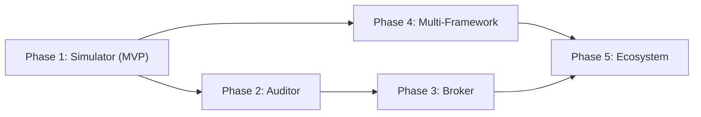

# 20 — Future Roadmap

> **Document Status:** Living Document · v1.0
> **Last Updated:** 2026-07-02
> **Owner:** Principal Product Manager / CTO
> **Audience:** Engineering, Product, Stakeholders, Investors, Recruiters
> **Depends On:** `19-mvp-definition.md`, `00-product-foundation.md`

---

## Table of Contents

1. [Purpose](#1-purpose)
2. [Goals](#2-goals)
3. [Scope](#3-scope)
4. [Executive Summary](#4-executive-summary)
5. [Phase 1: The Simulator (MVP — Month 0-3)](#5-phase-1-the-simulator-mvp--month-0-3)
6. [Phase 2: The Auditor (Month 3-6)](#6-phase-2-the-auditor-month-3-6)
7. [Phase 3: The Broker (Month 6-12)](#7-phase-3-the-broker-month-6-12)
8. [Phase 4: The Multi-Framework Platform (Month 12-18)](#8-phase-4-the-multi-framework-platform-month-12-18)
9. [Phase 5: The Ecosystem (Month 18-24+)](#9-phase-5-the-ecosystem-month-18-24)
10. [Horizon 3: Long-Term Vision (Year 3+)](#10-horizon-3-long-term-vision-year-3)
11. [Phase Dependencies & Critical Path](#11-phase-dependencies--critical-path)
12. [Tradeoffs](#12-tradeoffs)
13. [Risks](#13-risks)
14. [Future Expansion](#14-future-expansion)
15. [Dependencies](#15-dependencies)
16. [Engineering Notes](#16-engineering-notes)
17. [Recruiter Impact Notes](#17-recruiter-impact-notes)
18. [Business Impact Notes](#18-business-impact-notes)
19. [Document Cross-References](#19-document-cross-references)

---

## 1. Purpose

This document provides the long-term product and engineering roadmap for HalalTrade (working name). While the MVP (`19-mvp-definition.md`) defines the first 3 months, this document maps the next 24+ months of the product's evolution from a Paper Trading Simulator to a full Compliance-Aware Investing Operating System.

The roadmap exists to prove two things:
1. To the **engineering team**: Every architectural decision made in the MVP (pluggable rule evaluators, framework-agnostic portfolios, JSONB rule storage) was made with this long-term vision in mind.
2. To **investors and recruiters**: The product has a defensible, multi-year growth trajectory beyond its initial niche.

---

## 2. Goals

| # | Goal | Measure |
|---|---|---|
| FR-1 | Provide a 24-month engineering blueprint | Each phase has defined features, technical pre-requisites, and business milestones. |
| FR-2 | Validate MVP architecture | Demonstrate that every Phase 2-5 feature is enabled (not blocked) by the Phase 1 architecture. |
| FR-3 | Map TAM expansion | Show how each phase expands the Total Addressable Market from Halal-only to multi-framework. |

---

## 3. Scope

### 3.1 In Scope
- Feature descriptions and technical implications for Phases 1 through 5.
- Phase dependency mapping.
- Horizon 3 (speculative, long-term vision).

### 3.2 Out of Scope
- Sprint-level task breakdowns or Jira ticket specifications.
- Exact revenue projections or pricing models (Covered in `21-monetization.md`).

---

## 4. Executive Summary

The HalalTrade roadmap follows a deliberate **Concentric Expansion** strategy. Each phase adds a new ring of capability around the core Compliance Framework Engine:

| Phase | Codename | Core Capability | Primary User |
|---|---|---|---|
| **Phase 1** | The Simulator | Paper Trade + Halal Screening | Amir (Beginner) |
| **Phase 2** | The Auditor | Purification + Portfolio Analytics | Fatima (Analytical) |
| **Phase 3** | The Broker | Real Money Execution | All Users |
| **Phase 4** | The Platform | ESG + Custom Frameworks | Sarah (ESG) + David (Student) |
| **Phase 5** | The Ecosystem | Community + API + Marketplace | Educators, B2B Clients |

The architecture was intentionally designed so that **each phase extends the system without rewriting the core**. The `ComplianceCard` component built in Phase 1 renders ESG evaluations in Phase 4 with zero changes to its React code.

---

## 5. Phase 1: The Simulator (MVP — Month 0-3)

*Fully defined in `19-mvp-definition.md`. Summarized here for roadmap context.*

### 5.1 Feature Summary
- Google OAuth + Email/Password authentication.
- $100k Virtual Portfolio with Market Order execution.
- AAOIFI Halal Compliance Engine with rule-by-rule explainability.
- Configurable thresholds (user-overridable debt/interest limits).
- Command Palette search across US Equities.
- TradingView Lightweight Charts (15-min delayed).

### 5.2 Business Milestone
- First 500 registered users.
- Validate the "Aha!" moment via Guest-to-User conversion rate.

### 5.3 Technical Foundation Laid
- Modular Monolith (NestJS) with strict Bounded Contexts.
- `IRuleEvaluator` plugin interface for the Compliance Engine.
- JSONB framework storage in PostgreSQL.
- Redis caching layer and Anti-Corruption Layer (ACL) for market data.

---

## 6. Phase 2: The Auditor (Month 3-6)

### 6.1 Theme
Transform HalalTrade from a "try-before-you-buy simulator" into an indispensable **portfolio auditing tool** for existing investors.

### 6.2 Key Features

#### 6.2.1 The Purification Calculator
- **What:** Guides users through calculating the exact dollar amount of impermissible income embedded in their dividend payouts that must be donated to charity.
- **How:** A multi-step wizard reads the user's position history, fetches the `interestIncome` ratio for each holding, calculates the proportional amount, and outputs a per-stock and per-portfolio purification ledger.
- **Architecture Impact:** New `PurificationModule` in the NestJS backend. New `purification_ledger` table in PostgreSQL.

#### 6.2.2 Advanced Portfolio Analytics
- **What:** Portfolio-level metrics beyond basic PnL—Diversification Score, Sector Allocation Pie Chart, Historical Compliance Drift (tracking how a holding's compliance status changed over time).
- **Architecture Impact:** Frontend charting expansion (Recharts or Nivo for pie/bar charts).

#### 6.2.3 Watchlist Enhancements
- **What:** Price alerts (email/push notifications) when a watched stock's compliance status changes (e.g., a new earnings report pushes debt over the threshold).
- **Architecture Impact:** Requires implementing a Notification Service (email via SendGrid or Resend).

### 6.3 Business Milestone
- Achieve 5,000 MAU.
- Validate monetization hypothesis: Do users value Purification and Analytics enough to pay? (Soft paywall test).

---

## 7. Phase 3: The Broker (Month 6-12)

### 7.1 Theme
The highest-stakes engineering phase. Transition from virtual money to **real brokerage integration**, enabling users to execute live trades with compliance checks embedded in the flow.

### 7.2 Key Features

#### 7.2.1 Brokerage API Integration (Alpaca)
- **What:** Users link their Alpaca brokerage account (or similar) to HalalTrade. When they click "Buy," the order executes against their real brokerage account.
- **Architecture Impact:**
  - The `TradingModule` gains a new `LiveBrokerOrderService` alongside the existing `PaperOrderService`, selected via a strategy pattern.
  - Requires strict KYC/AML (Know Your Customer / Anti-Money Laundering) compliance, likely offloaded to the brokerage partner.

#### 7.2.2 Real-Time Data (WebSockets)
- **What:** Upgrade from 15-min delayed data to real-time streaming prices.
- **Architecture Impact:** Introduce a WebSocket Gateway module in NestJS. TanStack Query on the frontend integrates with the socket to dynamically update the query cache as ticks arrive.

#### 7.2.3 Limit Orders
- **What:** Support Limit Buy/Sell orders. The system places the order with the brokerage and monitors for execution.
- **Architecture Impact:** BullMQ workers must poll the brokerage API for order status updates (Filled, Partially Filled, Cancelled).

### 7.3 Business Milestone
- First revenue from premium tier (access to live trading features).
- Achieve 20,000 MAU.

### 7.4 Regulatory & Legal Prerequisites
- Terms of Service and Privacy Policy legal review.
- Partnership agreement with a licensed brokerage.
- Data usage licensing for real-time exchange data (NYSE/NASDAQ SIP fees).

---

## 8. Phase 4: The Multi-Framework Platform (Month 12-18)

### 8.1 Theme
Prove the multi-framework thesis by launching **ESG** and **Value Investing** compliance frameworks, expanding the TAM from ~$3.6T (Islamic Finance) to ~$40T+ (ESG).

### 8.2 Key Features

#### 8.2.1 ESG Framework Plugin
- **What:** A new set of `IRuleEvaluator` classes evaluating Environmental (Carbon Intensity, Water Usage), Social (Board Diversity, Labor Practices), and Governance (Executive Compensation) criteria.
- **Architecture Impact:** Zero changes to the `EngineCore`. New `RuleEvaluator` classes are registered in the DI container. A new `Framework` row with JSONB config is inserted into the database.
- **Data Impact:** Requires a new data vendor or enrichment source providing ESG-specific metrics (e.g., Sustainalytics raw data, or S&P Global ESG scores).

#### 8.2.2 Custom Framework Builder (Advanced)
- **What:** A drag-and-drop UI allowing power users to compose their own frameworks by selecting from a library of available rules and setting custom thresholds.
- **Route:** `/frameworks/builder`
- **Architecture Impact:** The `FrameworkConfigurator` component evolves from a simple slider panel to a complex form builder. The backend must validate the JSONB structure submitted by the user to prevent injection attacks.

#### 8.2.3 Framework Comparison View
- **What:** Evaluate a single asset against 2-3 frameworks simultaneously and render the results side-by-side.
- **Architecture Impact:** The `GET /compliance/evaluate` endpoint supports batch evaluation. The frontend renders parallel `ComplianceCard` components.

### 8.3 Business Milestone
- First non-Muslim user acquisition (ESG audience).
- Media coverage and thought leadership positioning.

---

## 9. Phase 5: The Ecosystem (Month 18-24+)

### 9.1 Theme
Transform HalalTrade from a product into a **platform** with network effects.

### 9.2 Key Features

#### 9.2.1 Community Framework Marketplace
- **What:** Users can publish their custom frameworks for others to browse, follow, and clone. (E.g., "Sheikh Zaid's Strict Halal Framework" or "Climate-First ESG Filter").
- **Route:** `/frameworks/discover`
- **Architecture Impact:** Add `is_public`, `author_id`, `follower_count`, and `rating` columns to the `frameworks` table. Introduce a review/moderation pipeline.

#### 9.2.2 Public Compliance API (B2B)
- **What:** Expose a rate-limited, key-authenticated version of `GET /compliance/evaluate` for third-party developers and brokerages to integrate Halal/ESG screening into their own apps.
- **Architecture Impact:** Implement API Key management, tiered usage billing (via Stripe Metered Billing), and API documentation (via Swagger/Redocly).

#### 9.2.3 Educational Partnerships
- **What:** Offer university professors and financial educators custom dashboard views to manage student groups and track their paper trading performance against various frameworks.
- **Route:** `/edu/dashboard`

### 9.3 Business Milestone
- B2B revenue stream from the Public API.
- Community-generated content creating a self-sustaining growth loop.

---

## 10. Horizon 3: Long-Term Vision (Year 3+)

These are speculative, directional themes rather than committed features.

| Vision | Description |
|---|---|
| **AI-Powered Compliance Advisor** | An LLM-powered chatbot that can answer questions like "Is Tesla Halal?" by interpreting the engine's output in conversational, culturally-sensitive language. |
| **Robo-Advisor Mode** | The platform auto-constructs and rebalances a portfolio optimized for the user's specific framework (e.g., "Build me the most diversified Halal portfolio with a $5,000 budget"). |
| **Global Market Expansion** | Support LSE, TSX, and other international exchanges, with localized compliance standards (e.g., Malaysian Shariah standards differ from AAOIFI). |
| **Mobile App (React Native)** | A dedicated iOS/Android app reusing the TanStack Query hooks and domain logic from the web platform. |

---

## 11. Phase Dependencies & Critical Path

**Key Insight:** Phases 2 and 4 can technically run **in parallel** because:
- Phase 2 (Purification) depends on the Trading Context (Phase 1).
- Phase 4 (ESG Frameworks) depends on the Compliance Context (Phase 1).
- These are different Bounded Contexts and don't block each other.

However, Phase 3 (Real Money) requires the portfolio analytics from Phase 2, and Phase 5 (Ecosystem) requires both the multi-framework support from Phase 4 and the live trading infrastructure from Phase 3.

---

## 12. Tradeoffs

| Decision | Chosen Option | Alternative | Rationale |
|---|---|---|---|
| **Expansion Order** | Halal First, ESG Later | Launch both simultaneously | Launching with a single framework allows the team to iterate on the UX of explainability before multiplying the complexity. Building for one audience deeply beats building for two audiences shallowly. |
| **Real Money Timing** | Phase 3 (Month 6+) | Phase 1 (MVP) | The regulatory, legal, and security overhead of real money would delay the MVP by 6+ months. Launching paper-only gets user feedback immediately while the legal groundwork proceeds in the background. |

---

## 13. Risks

| Risk | Severity | Mitigation |
|---|---|---|
| **Premature Scaling** | High | Spending 6 months on Phase 4 (ESG) before validating that Halal users retain in Phase 1. **Mitigation:** Strict KPI gates between phases. Do not begin Phase 2 engineering until Phase 1 retention targets are met. |
| **Regulatory Rejection** | High | A brokerage partner rejects our integration due to insufficient security practices. **Mitigation:** Begin Phase 3 legal and partnership discussions during Phase 1 engineering, giving 6+ months of lead time. |
| **Framework Marketplace Abuse** | Medium | A user publishes a community framework with intentionally wrong thresholds disguised as a legitimate scholarly opinion. **Mitigation:** Implement a moderation queue. Community frameworks display a "Not Verified" badge until reviewed by an internal compliance team. |

---

## 14. Future Expansion

This document *is* the future expansion plan. It will be updated quarterly as user feedback reshapes priorities.

---

## 15. Dependencies

| Dependency | Type | Impact |
|---|---|---|
| **Phase 1 Architecture Quality** | Internal | If the MVP is poorly modularized (e.g., Halal logic leaks into the Trading module), Phase 4 (ESG) will require a costly rewrite instead of a clean extension. |
| **Brokerage Partner (Phase 3)** | External/Legal | The timeline for Phase 3 is entirely dependent on securing a partnership with a licensed brokerage willing to provide API access to a startup. |

---

## 16. Engineering Notes

- **KPI Gates:** Do not begin the next phase until the current phase's success metrics are validated. Building Phase 3 features while Phase 1 users aren't retaining is a waste of capital.
- **Parallel Workstreams:** A small team (1 engineer) can begin scaffolding Phase 4 ESG Rule Evaluators as a "side quest" during Phase 2, since the Plugin Architecture guarantees zero interference with the main codebase.

---

## 17. Recruiter Impact Notes

### 17.1 What This Document Demonstrates
- **Strategic Product Vision:** Shows the ability to think far beyond the immediate sprint and plan a multi-year product evolution with clear business justification for each phase.
- **Architecture Validation:** Retrospectively proves that every controversial MVP decision (JSONB rules, pluggable evaluators, delayed data) was made in service of a concrete, phased expansion plan.
- **Investor-Grade Thinking:** The Concentric Expansion model (Niche → Broad → Platform → Ecosystem) mirrors the growth strategies of companies like Stripe, Figma, and Notion, demonstrating familiarity with B2C-to-B2B playbooks.

### 17.2 Talking Points
- "I designed the Phase 1 architecture specifically so that launching ESG in Phase 4 requires writing ~3 new TypeScript classes and inserting 1 database row—not a 6-month rewrite."
- "The roadmap follows a deliberate Concentric Expansion: first we own the niche (Halal), then we expand the audience (ESG), then we become the platform (API + Marketplace)."

---

## 18. Business Impact Notes

- **Investor Narrative:** The roadmap provides a clear story: Phase 1-2 validates PMF in a $3.6T niche, Phase 3-4 expands to a $40T+ TAM, and Phase 5 creates network effects and B2B revenue that make the company defensible.
- **Revenue Diversification:** By Phase 5, revenue comes from three independent streams: Consumer subscriptions (Premium analytics), B2B API licensing (Brokerages paying for compliance screening), and Community marketplace fees (Revenue share on premium community frameworks).

---

## 19. Document Cross-References

| Document | Relationship |
|---|---|
| `19-mvp-definition.md` | Provides the exhaustive definition of Phase 1. |
| `21-monetization.md` | Aligns the monetization model to the phases defined here. |
| `23-implementation-phases.md` | Provides the sprint-level engineering breakdown for executing these phases. |

---

> **End of Document**
>
> This roadmap is directional, not contractual. Phases may be reordered, compressed, or expanded based on user feedback and market conditions. The Phase 1 KPI gates are the only hard prerequisite.
